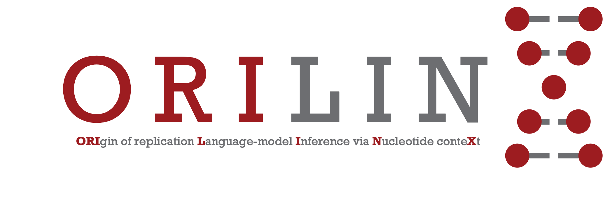

<p align='centre'> </p>

# ORILINX
[](https://orilinx.readthedocs.io/en/latest/?badge=latest)

ORILINX is a large language model built on DNABERT-2 to detect the location of replication origins in mammalian genomes. It is under active development by the [Boemo Group](https://www.boemogroup.org/) based in the [Department of Pathology, University of Cambridge](https://www.path.cam.ac.uk/).

## Singularity Image
The recommended way to run ORILINX is via our supported Singularity image: https://cloud.sylabs.io/library/mboemo/orilinx/orilinx
You can obtain the latest image by running:
```shell
singularity pull ORILINX.sif library://mboemo/orilinx/orilinx:1.0.0
```

## Building from Source

You can install the ORILINX package in editable mode for development:

```bash
git clone --recursive https://github.com/Pfuderer/ORILINX.git
cd ORILINX
pip install -e ."[all]"
```

This installs a console script named `orilinx` that runs prediction.

Note: Installing `torch` should follow your platform/GPU choice. For example for CUDA 12 you may use the recommended install from the PyTorch website or your package manager.

Also ensure `peft` is installed (used by the model code). You can install it directly with `pip install peft` or via the project extras: `pip install -e ."[all]"`.

## CLI usage

After installation, the top-level command `orilinx` runs prediction. An example of basic usage is:

```bash
orilinx --fasta_path /path/to/genome.fa --output_dir /path/to/out --write_csv --score prob
```

Key options:

- `--fasta_path` (required): Path to the reference FASTA file (.fa). An index (.fai) must be present.
- `--output_dir` (required): Directory where per-chromosome outputs will be written.
- `--sequence_length`: Tokenization length (must match DNABERT training length). Default: 2000.
- `--window` / `--stride`: Sliding-window size and stride in bp. Defaults: 2000 / 1000.
- `--max_N_frac`: Skip windows with a higher fraction of `N` bases. Default 0.05.
- `--batch_size`: Number of windows per batch (tune for throughput / memory).
- `--num_workers`: Number of DataLoader worker processes (0 runs in main process).
- `--write_csv` / `--write_bedgraph`: Output formats; CSV contains per-window rows, bedGraph writes center + score.
- `--score`: `logit` or `prob` (sigmoid). Default: `prob`.
- `--no-progress`: Disable progress bars (useful in non-interactive environments).
- `--verbose`: Print resolved DNABERT path, chosen checkpoint, device and runtime settings for debugging.

## Examples

```bash
# writes one CSV per chromosome
orilinx --fasta_path hg38.fa --output_dir ./out --write_csv --score prob

# Verbose output and no progress bars (for CI/logging)
orilinx --fasta_path hg38.fa --output_dir ./out --write_csv --score prob --verbose --no-progress
```

## Documentation
Please see the [documentation](https://orilinx.readthedocs.io) for detailed usage instructions, visualisation, and an example workflow.

## Citation
If you use ORILINX for your research, please cite our publication:

## Questions and Bugs
Should any bugs arise or if you have basic usage questions, please raise a [GitHub issue](https://github.com/Pfuderer/ORILINX/issues). For more detailed discussions or collaborations, please Email Michael Boemo at mb915@cam.ac.uk.